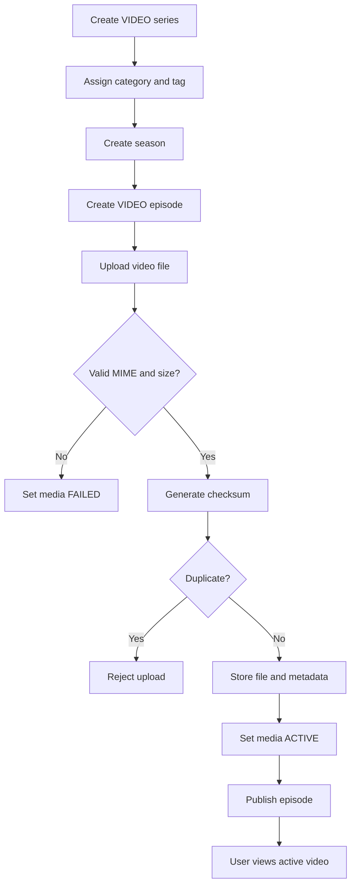
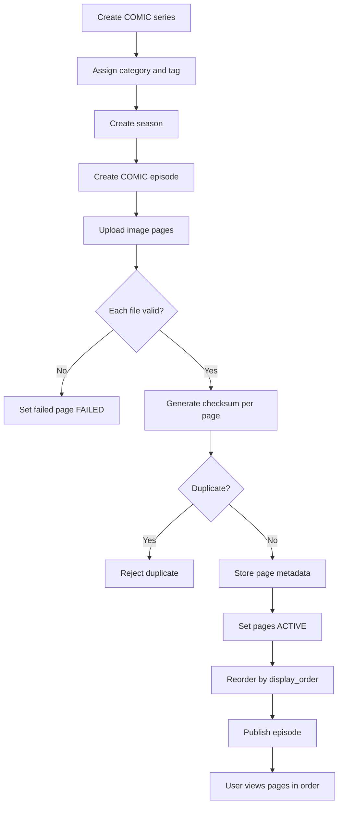

# Creator Upload & Manage Media Module

## A. Module Overview

This module lets creators/admins manage TaleX content structure and episode media without account/permission integration. It covers category, tag, series, season, episode, and media upload/management for video storytelling and comic/story content.

Out of scope: account/user FK, permission checks, view tracking, comments, likes, payment, subscription, recommendation, censorship, copyright, and rights complaints.

## B. Entity/Class List

### BaseAudit

| Field | Suggested type | Meaning |
| --- | --- | --- |
| created_at | LocalDateTime | Creation time |
| updated_at | LocalDateTime | Last update time |
| deleted_at | LocalDateTime | Soft-delete time |
| created_by | String | Nullable actor id, no FK |
| updated_by | String | Nullable actor id, no FK |
| deleted_by | String | Nullable actor id, no FK |
| is_deleted | Boolean | Soft-delete flag |

### Category

Fields: category_id String PK, category_name String, description Text, slug String, status CategoryStatus, audit fields.

Status: ACTIVE, INACTIVE, DELETED.

Relations: many-to-many with Series through SeriesCategory.

### Tag

Fields: tag_id String PK, tag_name String, description Text, slug String, status TagStatus, audit fields.

Status: ACTIVE, INACTIVE, DELETED.

Relations: many-to-many with Series through SeriesTag.

### Series

Fields: series_id String PK, creator_id String nullable/no FK, title String, description Text, cover_url Text, banner_url Text, content_type ContentType, status SeriesStatus, visibility Visibility, age_rating String, language String, total_views Long, total_subscriptions Long, audit fields.

Content type: VIDEO, COMIC.

Status: DRAFT, PUBLISHED, HIDDEN, DELETED.

Visibility: PUBLIC, PRIVATE.

Relations: one-to-many Season, many-to-many Category, many-to-many Tag.

### SeriesCategory

Fields: series_id String PK/FK, category_id String PK/FK, audit fields.

Rules: only ACTIVE and not deleted categories can be assigned.

### SeriesTag

Fields: series_id String PK/FK, tag_id String PK/FK, audit fields.

Rules: only ACTIVE and not deleted tags can be assigned.

### Season

Fields: season_id String PK, series_id FK, season_number Integer, title String, description Text, status SeasonStatus, audit fields.

Status: DRAFT, PUBLISHED, HIDDEN, DELETED.

Relations: many-to-one Series, one-to-many Episode.

### Episode

Fields: episode_id String PK, season_id FK, episode_number Integer, title String, description Text, content_type ContentType, status EpisodeStatus, published_at LocalDateTime, likes Long, views Long, total_page Integer, audit fields.

Content type: VIDEO, COMIC.

Status: DRAFT, PUBLISHED, HIDDEN, DELETED.

Relations: many-to-one Season, one-to-many Media.

### Media

Fields: media_id String PK, episode_id FK, media_type MediaType, mime_type String, file_url Text, file_size Long, checksum String, width Integer, height Integer, resolution String, duration Long, display_order Integer, status MediaStatus, audit fields.

Media type: VIDEO, IMAGE.

Status: PROCESSING, ACTIVE, HIDDEN, DELETED, FAILED.

Relations: many-to-one Episode.

## C. Relationships

- Series 1 - N Season
- Season 1 - N Episode
- Episode 1 - N Media
- Series N - N Category through SeriesCategory
- Series N - N Tag through SeriesTag

## D. Creator Upload Video Flow

1. Creator creates a VIDEO series with creator_id.
2. Creator assigns active categories and tags.
3. Creator creates a season.
4. Creator creates a VIDEO episode.
5. Creator submits one video media URL.
6. System validates that the URL is HTTP/HTTPS.
7. System generates a SHA-256 checksum from the URL and rejects duplicates.
8. System stores the URL and metadata.
9. System marks media status ACTIVE.
10. Creator publishes the episode.
11. User views the public published episode and active video media.

## E. Creator Upload Comic/Story Flow

1. Creator creates a COMIC series with creator_id.
2. Creator assigns active categories and tags.
3. Creator creates a season.
4. Creator creates a COMIC episode.
5. Creator submits multiple image page URLs.
6. System validates that each URL is HTTP/HTTPS.
7. System generates checksums from URLs and rejects duplicate URLs.
8. System stores metadata for each image page URL.
9. Creator reorders pages by display_order when needed.
10. Creator publishes the episode.
11. User views active image pages in display_order.

## F. API Endpoint Suggestions

### Category

- POST `/api/v1/categories`
- GET `/api/v1/categories`
- GET `/api/v1/categories/{id}`
- PUT `/api/v1/categories/{id}`
- PATCH `/api/v1/categories/{id}/hide`
- PATCH `/api/v1/categories/{id}/unhide`
- DELETE `/api/v1/categories/{id}`

### Tag

- POST `/api/v1/tags`
- GET `/api/v1/tags`
- GET `/api/v1/tags/{id}`
- PUT `/api/v1/tags/{id}`
- PATCH `/api/v1/tags/{id}/hide`
- PATCH `/api/v1/tags/{id}/unhide`
- DELETE `/api/v1/tags/{id}`

### Series

- POST `/api/v1/series`
- GET `/api/v1/series`
- GET `/api/v1/series/by-creator/{creatorId}`
- GET `/api/v1/series/{id}`
- PUT `/api/v1/series/{id}`
- PATCH `/api/v1/series/{id}/publish`
- PATCH `/api/v1/series/{id}/hide`
- PATCH `/api/v1/series/{id}/unhide`
- DELETE `/api/v1/series/{id}`

### Season

- POST `/api/v1/series/{seriesId}/seasons`
- GET `/api/v1/series/{seriesId}/seasons`
- GET `/api/v1/seasons/{id}`
- PUT `/api/v1/seasons/{id}`
- PATCH `/api/v1/seasons/{id}/publish`
- PATCH `/api/v1/seasons/{id}/hide`
- PATCH `/api/v1/seasons/{id}/unhide`
- DELETE `/api/v1/seasons/{id}`

### Episode

- POST `/api/v1/seasons/{seasonId}/episodes`
- GET `/api/v1/seasons/{seasonId}/episodes`
- GET `/api/v1/episodes/{id}`
- PUT `/api/v1/episodes/{id}`
- PATCH `/api/v1/episodes/{id}/publish`
- PATCH `/api/v1/episodes/{id}/hide`
- PATCH `/api/v1/episodes/{id}/unhide`
- DELETE `/api/v1/episodes/{id}`

### Media

- POST `/api/v1/episodes/{episodeId}/media`
- POST `/api/v1/episodes/{episodeId}/media/comic-pages`
- GET `/api/v1/episodes/{episodeId}/media`
- GET `/api/v1/media/{id}`
- PUT `/api/v1/media/{id}`
- PUT `/api/v1/media/{id}/url`
- PUT `/api/v1/episodes/{episodeId}/media/reorder`
- PATCH `/api/v1/media/{id}/hide`
- PATCH `/api/v1/media/{id}/unhide`
- PATCH `/api/v1/media/{id}/status`
- DELETE `/api/v1/media/{id}`

### Public

- GET `/api/v1/public/categories`
- GET `/api/v1/public/tags`
- GET `/api/v1/public/series`
- GET `/api/v1/public/series/{seriesId}`
- GET `/api/v1/public/series/{seriesId}/seasons`
- GET `/api/v1/public/seasons/{seasonId}`
- GET `/api/v1/public/seasons/{seasonId}/episodes`
- GET `/api/v1/public/episodes/{episodeId}`
- GET `/api/v1/public/episodes/{episodeId}/media`
- GET `/api/v1/public/media/{mediaId}`

## G. Mermaid ERD

```mermaid
erDiagram
    CATEGORY {
        string category_id PK
        string category_name
        string description
        string slug
        string status
        datetime created_at
        datetime updated_at
        datetime deleted_at
        string created_by
        string updated_by
        string deleted_by
        boolean is_deleted
    }

    TAG {
        string tag_id PK
        string tag_name
        string description
        string slug
        string status
        datetime created_at
        datetime updated_at
        datetime deleted_at
        string created_by
        string updated_by
        string deleted_by
        boolean is_deleted
    }

    SERIES {
        string series_id PK
        string creator_id
        string title
        string description
        string cover_url
        string banner_url
        string content_type
        string status
        string visibility
        string age_rating
        string language
        long total_views
        long total_subscriptions
        datetime created_at
        datetime updated_at
        datetime deleted_at
        string created_by
        string updated_by
        string deleted_by
        boolean is_deleted
    }

    SERIES_CATEGORY {
        string series_id PK, FK
        string category_id PK, FK
        datetime created_at
        datetime updated_at
        datetime deleted_at
        string created_by
        string updated_by
        string deleted_by
        boolean is_deleted
    }

    SERIES_TAG {
        string series_id PK, FK
        string tag_id PK, FK
        datetime created_at
        datetime updated_at
        datetime deleted_at
        string created_by
        string updated_by
        string deleted_by
        boolean is_deleted
    }

    SEASON {
        string season_id PK
        string series_id FK
        int season_number
        string title
        string description
        string status
        datetime created_at
        datetime updated_at
        datetime deleted_at
        string created_by
        string updated_by
        string deleted_by
        boolean is_deleted
    }

    EPISODE {
        string episode_id PK
        string season_id FK
        int episode_number
        string title
        string description
        string content_type
        string status
        datetime published_at
        long likes
        long views
        int total_page
        datetime created_at
        datetime updated_at
        datetime deleted_at
        string created_by
        string updated_by
        string deleted_by
        boolean is_deleted
    }

    MEDIA {
        string media_id PK
        string episode_id FK
        string media_type
        string mime_type
        string file_url
        long file_size
        string checksum
        int width
        int height
        string resolution
        long duration
        int display_order
        string status
        datetime created_at
        datetime updated_at
        datetime deleted_at
        string created_by
        string updated_by
        string deleted_by
        boolean is_deleted
    }

    SERIES ||--o{ SEASON : has
    SEASON ||--o{ EPISODE : has
    EPISODE ||--o{ MEDIA : has
    SERIES ||--o{ SERIES_CATEGORY : maps
    CATEGORY ||--o{ SERIES_CATEGORY : maps
    SERIES ||--o{ SERIES_TAG : maps
    TAG ||--o{ SERIES_TAG : maps
```

## H. Mermaid Flowcharts

### Creator Upload Video Episode

### Creator Upload Comic/Story Episode

## I. Implementation Notes

- Soft delete is implemented with `is_deleted`, `deleted_at`, and `deleted_by`.
- Hide keeps records restorable; delete marks status DELETED and soft-deletes.
- Draft content is creator/admin-visible only; public APIs require published/public status.
- Media creation stores external HTTP/HTTPS URLs; the Java backend no longer uploads episode media files.
- URL checksums are generated with SHA-256 to reject duplicate media URLs.
- Comic pages are returned and reorderable by `display_order`.
- Cloudinary upload is not used by the episode media API.
- Video episodes accept one active video media. `display_order` is not used for video media.
- Comic episodes can submit multiple image page URLs in one request using `pages`; `displayOrder` is required for every page and is used for reading order.
- Account/user tables are intentionally not referenced by FK. Actor fields are nullable strings.
- Future modules can attach real account, permission, censorship, copyright, and payment logic without changing the content hierarchy.
